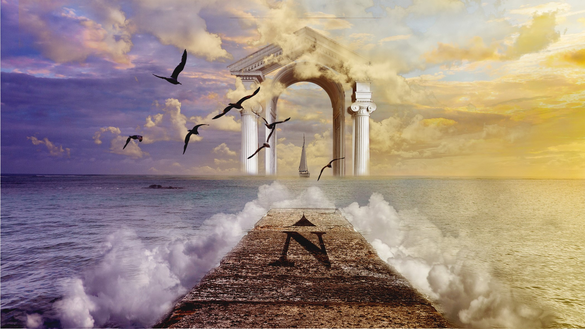
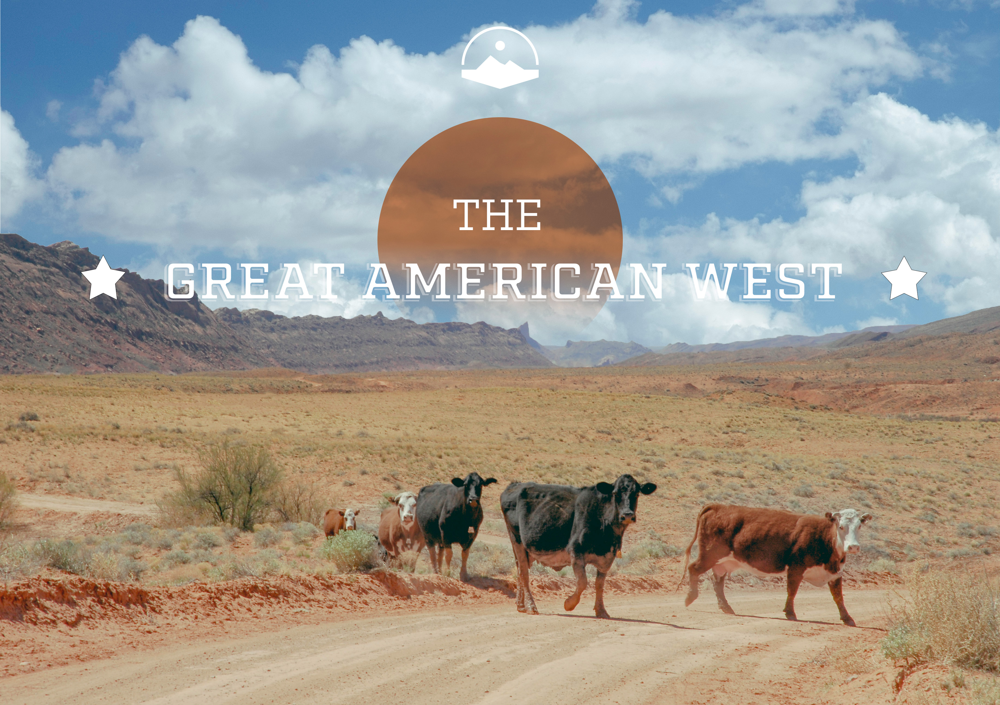

<!DOCTYPE html>
<html lang="en">
<head>
    <meta charset="UTF-8">
    <meta name="viewport" content="width=device-width, initial-scale=1.0">
    <title>Art portfolio</title>
</head>
<body>
    <h1>My Art portfolio</h1>
    

This website is gallery of my favorite art works.

<h1><strong>1. Dream Like World</strong></h1>

 This piece is one of my first Adobe photoshop picecs I was tasked to make.

<h2><strong>2.The Great West</strong></h2>

 In this image I had to practice combining multiple images together as well as learn how to work with the fonts.

<h3><strong>3. In My Mind </strong></h3>

This piece is a painting I recently finished were I was practicing different brush techniuqes and hand holds.

</body>
</html>

