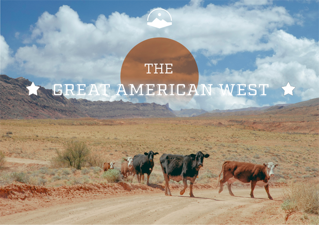
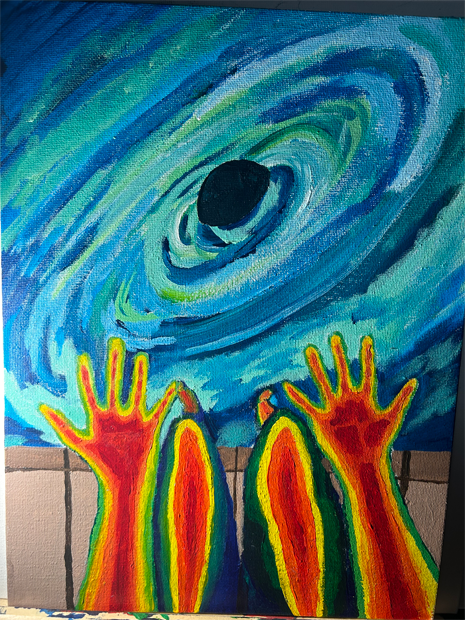

<!DOCTYPE html>
<html lang="en">
<head>
    <meta charset="UTF-8">
    <meta name="viewport" content="width=device-width, initial-scale=1.0">
    <title>Art portfolio</title>
    <link href="main.css" rel="stylesheet" type="text/css">

<link rel="preconnect" href="https://fonts.googleapis.com">
<link rel="preconnect" href="https://fonts.gstatic.com" crossorigin>
<link href="https://fonts.googleapis.com/css2?family=Bebas+Neue&family=Caveat:wght@400..700&family=Sixtyfour&display=swap" rel="stylesheet">
</head>
<body>
 <h1 class="title"> My Art portfolio</h1> 
  

This website is gallery of my favorite art works.

<h2 id="headings"><strong>1. Dream Like World</strong></h2>

 This piece is one of my first Adobe photoshop picecs I was tasked to make.

<h2 id="headings"><strong>2.The Great West</strong></h2>

 In this image I had to practice combining multiple images together as well as learn how to work with the fonts.

<h2 id="headings"><strong>3. In My Mind </strong></h2>

This piece is a painting I recently finished were I was practicing different brush techniuqes and hand holds.

<h2 id="headings"><strong> Inspiration</strong></h2>

 A lot of my inspiration comes from other art I view or events that happen in life. A source that that helps me get creative as well is <a href="https://www.pinterest.com/" target="_blank"> pintrest. </a> 
   I also take inspiration and advice from Youtubers such as: Jazza  <iframe width="560" height="315" src="https://www.youtube.com/embed/8hcZDNH3_Wc?si=vOr6ZAlfZUY-dbQz" title="YouTube video player" frameborder="0" allow="accelerometer; autoplay; clipboard-write; encrypted-media; gyroscope; picture-in-picture; web-share" referrerpolicy="strict-origin-when-cross-origin" allowfullscreen></iframe>

<a href="Port.html">Learn more about Me</a>

<h2 id="headings"><strong> Review</strong></h2>
<form>
  <label for="fname">First name:</label> 
  <input type="text" id="fname" name="fname"> 
  <label for="lname">Last name:</label> 
  <input type="text" id="lname" name="lname">
</form>

 <input type="text" id="lname" name="lname" value="input">
  
  <input type="submit" value="Submit">
    
</form> 
</body>
</html>

